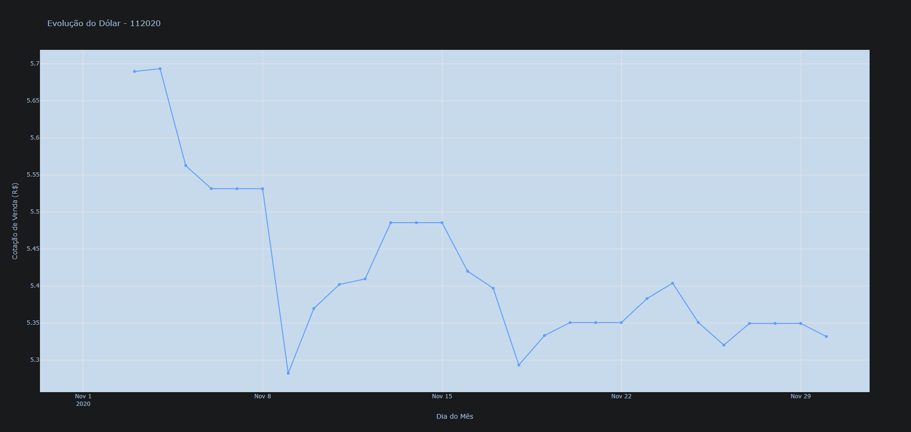

# Atividade 1 - Cotação do Dólar

Nesta atividade, o desafio foi consumir a API "Olho Vivo" da SPTrans para cruzar dados estáticos (pontos de parada) com dados dinâmicos (posição GPS dos ônibus). O resultado final é um mapa interativo onde podemos ver se o ônibus está perto do ponto.

## Código e explicação:

Primeiro, importamos as bibliotecas necessárias. Nas datas de início e fim que a API exige. Usamos a biblioteca calendar para descobrir automaticamente qual é o último dia daquele mês.

```markdown
---
import requests
import pandas as pd
import plotly.express as px
import calendar
from datetime import datetime

def gerar_grafico_cotacao(mes_ano_str):

    try:
        data_inicial_dt = datetime.strptime(mes_ano_str, "%m%Y")
    except ValueError:
        print("Formato inválido. Use MMYYYY (ex: 112020).")
        return

    ultimo_dia = calendar.monthrange(data_inicial_dt.year, data_inicial_dt.month)[1]
    data_final_dt = data_inicial_dt.replace(day=ultimo_dia)

    data_ini_api = data_inicial_dt.strftime("%m-%d-%Y")
    data_fim_api = data_final_dt.strftime("%m-%d-%Y")

    print(f"Consultando período: {data_ini_api} até {data_fim_api}...")
---
```

Aqui montamos a URL de consulta ao serviço "Olinda" do Banco Central. Utilizamos a rotina CotacaoDolarPeriodo que retorna todos os dados de uma vez. O bloco try/except garante que, se a internet falhar ou a API estiver fora do ar, o programa não quebre.

```markdown
---
url = (
        f"https://olinda.bcb.gov.br/olinda/servico/PTAX/versao/v1/odata/"
        f"CotacaoDolarPeriodo(dataInicial=@dataInicial,dataFinalCotacao=@dataFinalCotacao)?"
        f"@dataInicial='{data_ini_api}'&@dataFinalCotacao='{data_fim_api}'&$format=json"
    )

    try:
        response = requests.get(url)
        dados_json = response.json()
    except Exception as e:
        print(f"Erro ao acessar API: {e}")
        return

    if not dados_json.get('value'):
        print("Nenhuma cotação encontrada para este período na API.")
        return
---
```

Esta é a parte mais importante da lógica. A API só retorna dias úteis. Para o gráfico ficar contínuo, criamos um calendário completo do mês e usamos a técnica de Forward Fill (ffill). Isso preenche os dias vazios (sábados, domingos) com o valor da sexta-feira anterior. 
Destaque: Usamos .dt.normalize() para garantir que as horas não atrapalhem a junção das datas.

```markdown
---
df = pd.DataFrame(dados_json['value'])

    df = df[['dataHoraCotacao', 'cotacaoVenda']]

    df['dataHoraCotacao'] = pd.to_datetime(df['dataHoraCotacao']).dt.normalize()
    
    df = df.groupby('dataHoraCotacao').last()

    todos_dias = pd.date_range(start=data_inicial_dt, end=data_final_dt, freq='D')

    df_completo = df.reindex(todos_dias)

    df_completo['cotacaoVenda'] = df_completo['cotacaoVenda'].ffill()

    df_completo = df_completo.reset_index()
    df_completo.rename(columns={'index': 'Data', 'cotacaoVenda': 'Valor (R$)'}, inplace=True)
---
```

Por fim, utilizamos a biblioteca plotly.express para gerar um gráfico de linhas interativo. Ele permite visualizar o valor exato ao passar o mouse sobre os pontos ("markers").

```markdown
---
print("Gerando gráfico...")

    fig = px.line(
        df_completo, 
        x="Data", 
        y="Valor (R$)", 
        title=f"Evolução do Dólar - {mes_ano_str}",
        markers=True
    )
    
    fig.update_layout(xaxis_title="Dia do Mês", yaxis_title="Cotação de Venda (R$)")
    fig.show()

if __name__ == "__main__":
    gerar_grafico_cotacao("112020")
---
```

## Saída

O gráfico gerado a partir do código aprensentado:


