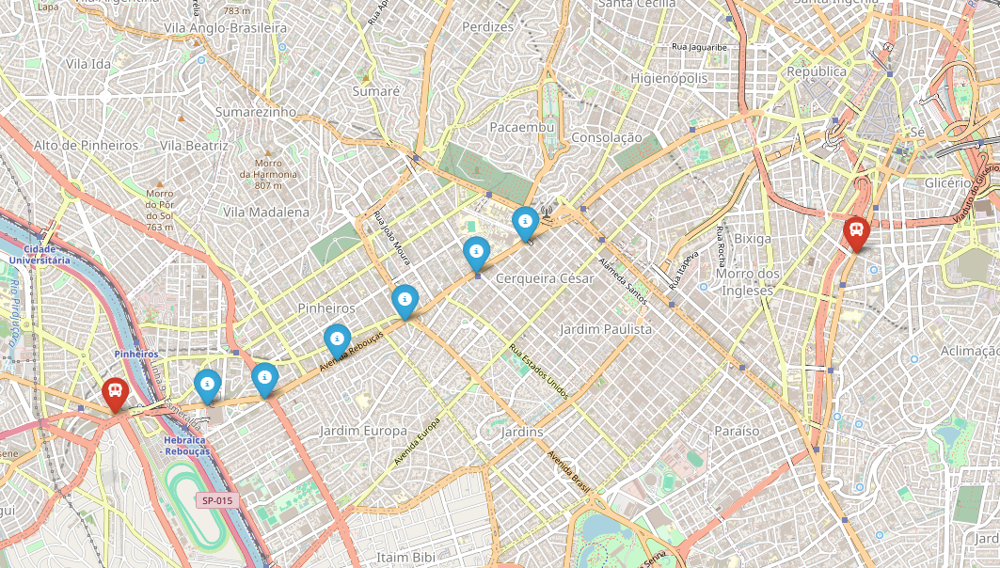

# Atividade 2 - Monitoramento de Frota de Ônibus

Nesta atividade, o desafio foi consumir a API "Olho Vivo" da SPTrans para cruzar dados estáticos (pontos de parada) com dados dinâmicos (posição GPS dos ônibus). O resultado final é um mapa interativo onde podemos ver se o ônibus está perto do ponto.

## Código e explicação:

Para acessar os dados da SPTrans, é necessário um token de desenvolvedor. Criamos uma classe MonitoramentoSPTrans para gerenciar a conexão. 
Destaque: Utilizamos requests.Session() para manter a sessão aberta. A API exige que a autenticação seja feita via POST e que os cookies recebidos sejam mantidos para as requisições seguintes.

```markdown
---
import requests
import folium
from folium import plugins

TOKEN = "SEU_TOKEN_AQUI" 
TERMO_BUSCA_LINHA = "715M" 

class MonitoramentoSPTrans:
    def __init__(self, token):
        self.base_url = "http://api.olhovivo.sptrans.com.br/v2.1"
        self.token = token
        self.session = requests.Session()
        self.autenticado = False

    def autenticar(self):
        url = f"{self.base_url}/Login/Autenticar?token={self.token}"
        response = self.session.post(url)
        if response.text == "true":
            self.autenticado = True
            print("Autenticação realizada com sucesso!")
            return True
        else:
            print("Falha na autenticação. Verifique seu TOKEN.")
            return False
---
```

A API funciona com códigos internos. Primeiro, buscamos a linha pelo nome (ex: "715M") para descobrir seu "Código de Linha" (cl). Com esse código em mãos, fazemos duas buscas separadas:

Paradas: Onde ficam os pontos (latitude/longitude fixas).

Posições: Onde estão os veículos neste exato momento.

```markdown
---
def buscar_linha(self, termo):
        if not self.autenticado: return None
        
        url = f"{self.base_url}/Linha/Buscar?termosBusca={termo}"
        response = self.session.get(url)
        linhas = response.json()
        
        if not linhas:
            print(f"Nenhuma linha encontrada para '{termo}'.")
            return None

        linha_selecionada = linhas[0]
        print(f"Linha encontrada: {linha_selecionada['lt']}-{linha_selecionada['tl']} ({linha_selecionada['tp']} -> {linha_selecionada['ts']})")
        return linha_selecionada['cl']

    def buscar_paradas(self, codigo_linha):
        if not self.autenticado: return []
        
        url = f"{self.base_url}/Parada/BuscarParadasPorLinha?codigoLinha={codigo_linha}"
        response = self.session.get(url)
        return response.json()

    def buscar_posicoes(self, codigo_linha):
        if not self.autenticado: return {}
        
        url = f"{self.base_url}/Posicao/Linha?codigoLinha={codigo_linha}"
        response = self.session.get(url)
        data = response.json()
        return data.get('vs', [])
---
```

Com os dados em mãos, usamos a biblioteca folium para gerar o mapa.

Centralizamos a visão na primeira parada encontrada.

Pontos de Parada: Marcados com ícones azuis (info-sign).

Ônibus: Marcados com ícones vermelhos de ônibus (bus), representando a posição em tempo real.

```markdown
---
def gerar_mapa_monitoramento():
    sp_trans = MonitoramentoSPTrans(TOKEN)

    if not sp_trans.autenticar():
        return

    codigo_linha = sp_trans.buscar_linha(TERMO_BUSCA_LINHA)
    if not codigo_linha:
        return

    paradas = sp_trans.buscar_paradas(codigo_linha)
    print(f"Encontradas {len(paradas)} paradas.")

    veiculos = sp_trans.buscar_posicoes(codigo_linha)
    print(f"Encontrados {len(veiculos)} veículos operando no momento.")

    if not paradas:
        print("Não foi possível gerar o mapa sem paradas.")
        return

    mapa = folium.Map(location=[paradas[0]['py'], paradas[0]['px']], zoom_start=13)

    for p in paradas:
        folium.Marker(
            location=[p['py'], p['px']],
            popup=f"Parada: {p['np']}<br>{p['ed']}",
            icon=folium.Icon(color='blue', icon='info-sign')
        ).add_to(mapa)

    for v in veiculos:
        folium.Marker(
            location=[v['py'], v['px']],
            popup=f"Ônibus Prefixo: {v['p']}",
            icon=folium.Icon(color='red', icon='bus', prefix='fa')
        ).add_to(mapa)

    nome_arquivo = f"mapa_linha_{TERMO_BUSCA_LINHA}.html"
    mapa.save(nome_arquivo)
    print(f"Mapa gerado com sucesso: {nome_arquivo}")

if __name__ == "__main__":
    gerar_mapa_monitoramento()
---
```

## Saída

O resultado gerado a partir do código aprensentado:


