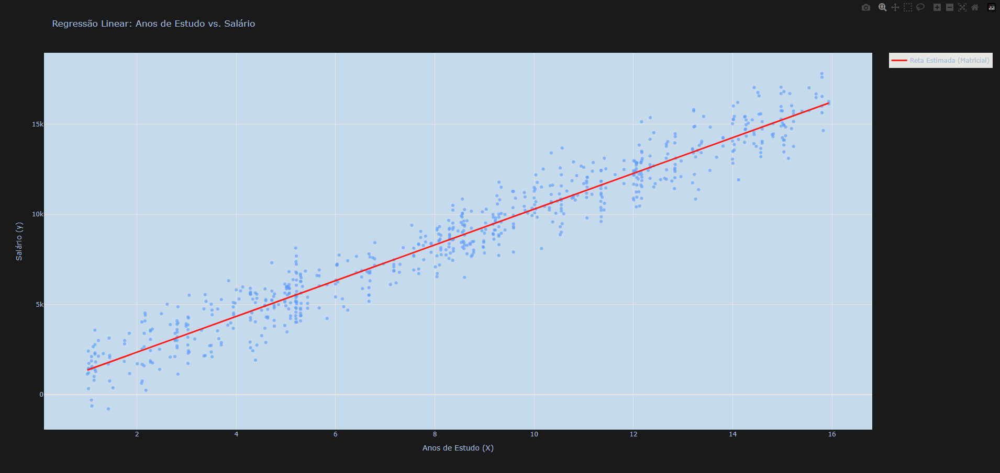

# Atividade 1 - Cotação do Dólar

Nesta atividade, deixamos de lado as bibliotecas de Machine Learning prontas (como o scikit-learn) para implementar o cálculo matemático puro da Regressão Linear. O objetivo é encontrar a reta que melhor se ajusta aos dados de "Anos de Estudo" vs "Salário" utilizando a Equação Normal (método matricial).

Abaixo, explico como o algoritmo foi construído.

## Código e explicação:

O primeiro passo é obter os dados. A função tenta ler os arquivos X.txt e y.txt. Caso eles não existam (o que é útil para testes), ela gera dados simulados automaticamente para garantir que o código sempre rode.

```markdown
---
import numpy as np
import plotly.express as px
import plotly.graph_objects as go

def carregar_dados():
    try:
        X = np.loadtxt('X.txt')
        y = np.loadtxt('y.txt')
        print("Arquivos X.txt e y.txt carregados com sucesso.")
    except OSError:
        print("Arquivos não encontrados. Gerando dados simulados para exemplo...")
        np.random.seed(42)
        X = 2 * np.random.rand(100, 1) * 10 
        y = 1000 + 200 * X + np.random.randn(100, 1) * 200
        y = y.flatten()
        X = X.flatten()
    
    return X, y
---
```

Aqui aplicamos a matemática pura. Para resolver a regressão linear sem loops de otimização, usamos a fórmula da Equação Normal: $\beta = (X^T X)^{-1} X^T y$.Adição do Viés: Primeiro, adicionamos uma coluna de "1s" à matriz X. Isso é necessário para que a álgebra linear calcule o "intercepto" (onde a reta cruza o eixo Y).Operações: Usamos numpy para fazer a Transposta (.T), a Inversa (np.linalg.inv) e a Multiplicação de Matrizes (@).

```markdown
---
def calcular_regressao_matricial(X, y):
    # Adiciona uma coluna de 1s para o intercepto
    X_b = np.c_[np.ones((len(X), 1)), X]

    # Aplica a fórmula da Equação Normal
    theta_best = np.linalg.inv(X_b.T @ X_b) @ X_b.T @ y

    return theta_best[0], theta_best[1]
---
```

Com os coeficientes $a$ (intercepto) e $b$ (inclinação) calculados, podemos traçar a reta.Criamos os pontos da reta usando a equação $y = a + b \cdot x$.Usamos o Plotly para criar um gráfico que combina a dispersão dos dados reais (pontos azuis) com a nossa reta estimada (linha vermelha).

```markdown
---
def gerar_grafico(X, y, a, b):
    print(f"\n--- Resultado da Regressão ---")
    print(f"Intercepto (a): {a:.2f}")
    print(f"Coeficiente Angular (b): {b:.2f}")
    print(f"Equação da reta: y = {a:.2f} + {b:.2f} * x")

    x_range = np.linspace(min(X), max(X), 100)
    y_pred = a + b * x_range

    # Gráfico de dispersão (Pontos reais)
    fig = px.scatter(
        x=X, 
        y=y, 
        opacity=0.65,
        title='Regressão Linear: Anos de Estudo vs. Salário',
        labels={'x': 'Anos de Estudo (X)', 'y': 'Salário (y)'}
    )

    # Adiciona a reta calculada
    fig.add_trace(
        go.Scatter(
            x=x_range, 
            y=y_pred, 
            mode='lines', 
            name='Reta Estimada (Matricial)',
            line=dict(color='red', width=3)
        )
    )

    fig.show()

if __name__ == "__main__":
    X_dados, y_dados = carregar_dados()
    a_calculado, b_calculado = calcular_regressao_matricial(X_dados, y_dados)
    gerar_grafico(X_dados, y_dados, a_calculado, b_calculado)
---
```

## Saída

O gráfico gerado a partir do código aprensentado:


